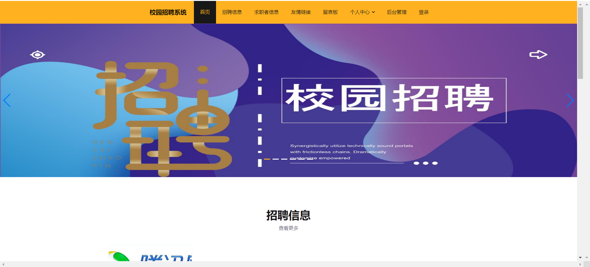
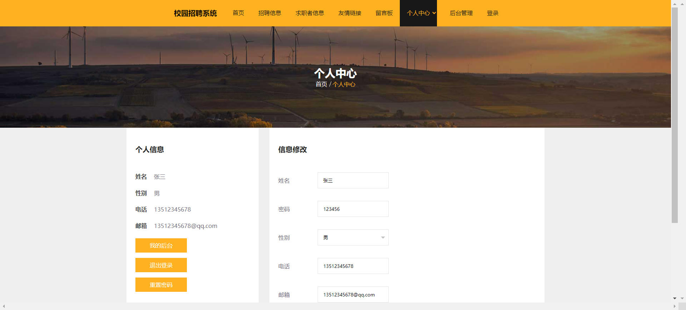

# campus-system🎂

基于SpringBoot+Vue的校园招聘管理系统

## 介绍🌞

> 该系统实现了管理员管理、用户信息管理、企业信息管理等功能模块。在本系统中，超级管理员具有完整的数据管理权限，可以对学生用户和企业用户的信息内容以及他们之间交互的信息进行管理；学生用户可以查看企业招聘的详细信息，对感兴趣的企业进行申请、收藏；企业用户可以在后台系统中在申请人的信息中下载简历，进行应聘者进行审核，用户可以登录后台进行个人信息修改，查看应聘信息和审核回复。

## 软件架构🌞

> 用户端

.jpg)

> 管理端


## 项目演示🌞

> 普通用户







> 企业端


> 管理端


## 安装教程🌞

```
1. 运行环境准备mysql8 + java8 + node14.16.1

2. 配置maven路径，加载依赖

3. 运行sql文件，确保application.yml或config.properties的数据库名称和账号密码是数据库所在主机的账号密码
```


## 使用说明🌞

```
1. 登入

	管理员账号：admin 密码：123456

	学生账号：zhangsan 密码：123456

	企业账号：tengxun 密码：123456
  
2. 运行流程

SpringBoot+Vue项目的部署详情可以查看这篇CSDN博客：http://t.csdnimg.cn/kpuxS

前后端不分离项目的部署流程可以查看这篇CSDN博客：http://t.csdnimg.cn/CslA5
```


## CSDN项目合集🌞

点击前往：http://t.csdnimg.cn/Q4u84


## 联系我🌞

**有偿获取完整源码或调试代码**

🐧：1902317191

we-chat：coding1902317191
